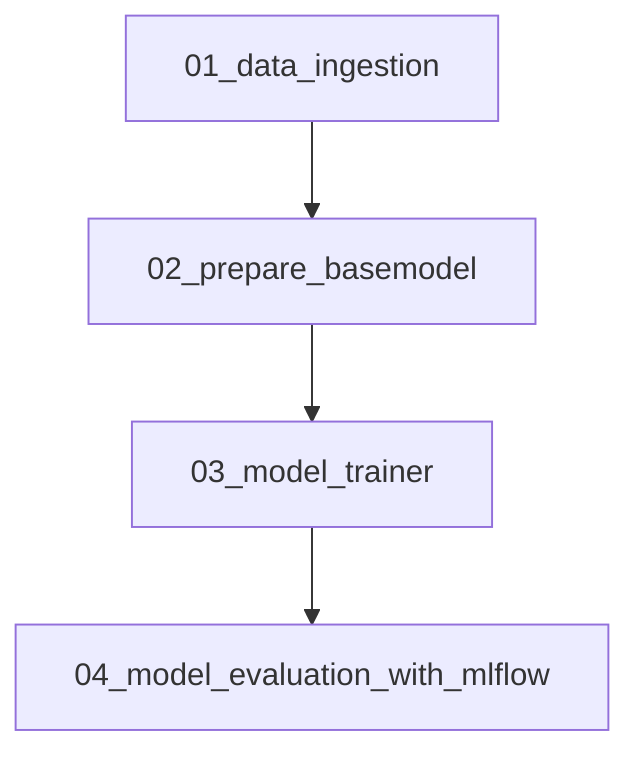

# 🩺 ChestScan AI - Chest Cancer Prediction

[](https://www.python.org/)
[](https://www.tensorflow.org/)
[](https://flask.palletsprojects.com/)
[](https://mlflow.org/)
[](https://dvc.org/)
[](https://developer.mozilla.org/en-US/docs/Web/Guide/HTML/HTML5)
[](https://developer.mozilla.org/en-US/docs/Web/CSS)
[](https://jquery.com/)
[](LICENSE)

---

## 📌 Project Overview

**ChestScan AI** is a complete end-to-end MLOps project that automates the detection of **Adenocarcinoma Cancer** from chest CT scan images using a deep learning model based on VGG16.

This project integrates:
- ✅ **TensorFlow** for model development  
- ✅ **MLflow** for experiment tracking and model management  
- ✅ **DVC** for dataset versioning and pipeline reproducibility  
- ✅ **Flask + HTML/CSS/jQuery** for a simple prediction UI

It’s more than a model — it’s a reproducible, scalable machine learning system built with real-world MLOps tools.

---

## ⚙️ Installation Instructions

Clone the repository:

```bash
git clone https://github.com/yourusername/Chest-Cancer-Detection.git
cd Chest-Cancer-Detection
````

Install the dependencies:

```bash
pip install tensorflow==2.12.0 pandas gdown dvc mlflow==2.2.2 notebook flask scikit-learn matplotlib opencv-python
```

---

## 🔁 Workflow Details

This project uses a YAML-config-driven modular pipeline design.

### 📂 Key Configs

* `config.yaml`: paths and artifacts
* `params.yaml`: hyperparameters (image size, batch size, etc.)
* `secrets.yaml`: (optional) for credentials
* `dvc.yaml`: pipeline orchestration

### 🧱 Steps to Modify

1. Update `config.yaml`
2. Update `params.yaml` if needed
3. Modify entities and configuration manager
4. Implement pipeline components
5. Link everything in `main.py`
6. Use `dvc repro` to run the full pipeline

---

## 🔬 Process Steps



```
📁 01_data_ingestion
    ⤷ Downloads and extracts CT scan dataset

📁 02_prepare_basemodel
    ⤷ Loads pretrained VGG16, modifies top layer

📁 03_model_trainer
    ⤷ Trains model with data generators and augmentation

📁 04_model_evaluation_with_mlflow
    ⤷ Logs metrics, artifacts, and model to MLflow
```

---

## 🧠 Model Specification

| Parameter    | Value           |
| ------------ | --------------- |
| AUGMENTATION | ✅ True          |
| IMAGE\_SIZE  | `[224, 224, 3]` |
| BATCH\_SIZE  | `16`            |
| INCLUDE\_TOP | ❌ False         |
| EPOCHS       | `15`            |
| CLASSES      | `2`             |
| WEIGHTS      | `imagenet`      |

### 📊 Final Performance Metrics

```json
{
  "loss": 0.22484230995178223,
  "accuracy": 0.9791666865348816
}
```

---

## 🧰 Technology Stack

| Layer               | Tool/Tech          | Reason for Use                              |
| ------------------- | ------------------ | ------------------------------------------- |
| Frontend            | HTML, CSS, jQuery  | Lightweight, fast UI for testing            |
| Backend             | Flask              | Python-native, easy API layer               |
| Model               | TensorFlow + VGG16 | Fast convergence + transfer learning        |
| Orchestration       | DVC                | Pipeline, artifact, and dataset tracking    |
| Experiment Tracking | MLflow             | Logs params, metrics, artifacts, and models |

---

## 📈 MLflow Experiment Tracking

* Every training run is logged using **MLflow**
* Tracks:

  * Parameters
  * Metrics (loss, accuracy)
  * Models and artifacts
* UI Access:

```bash
mlflow ui
```

Visit [http://localhost:8080](http://localhost:8080) in your browser.

---

## 📦 DVC Integration

* Tracks datasets and models across versions
* Reproducible pipelines using `dvc.yaml`
* Run the full pipeline with:

```bash
dvc repro
```

* Collaborators can sync the data with:

```bash
dvc pull
```

---

## 🖼️ Screenshots

### 🔍 Model Prediction UI


### 📊 MLflow Dashboard


---

## 🔮 Future Improvements

* ✅ Add Docker support for deployment
* ✅ Enable GitHub Actions for CI/CD
* 🔍 Add Grad-CAM visualizations for explainability
* 📦 Publish to Hugging Face or TensorFlow Hub

---

## 📄 License

This project is licensed under the **MIT License** – see the [LICENSE](LICENSE) file for details.

---

## 🙌 Credits

Created by **Naresh B A**

* 🎓 B.Tech IT, Sri Sairam Institute of Technology
* 💡 Full Stack Developer | AI/ML Enthusiast
* 🔗 [LinkedIn](www.linkedin.com/in/naresh-b-a-1b5331243)

Drop a ⭐ if you found this project helpful!

```

